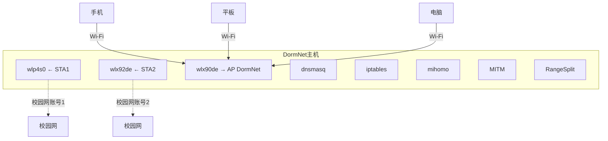
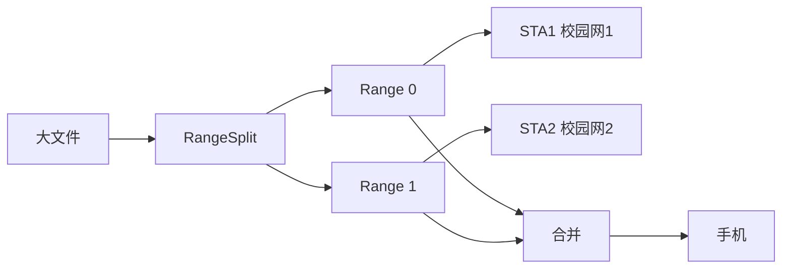
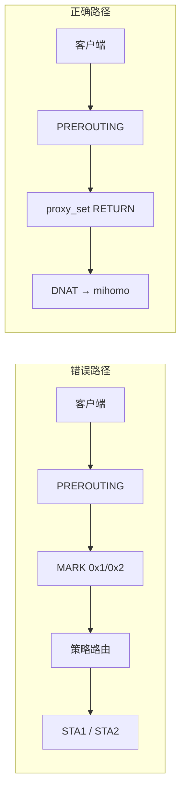
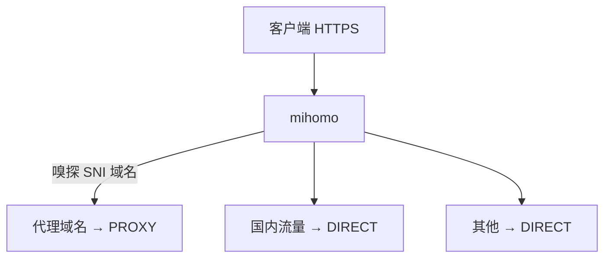
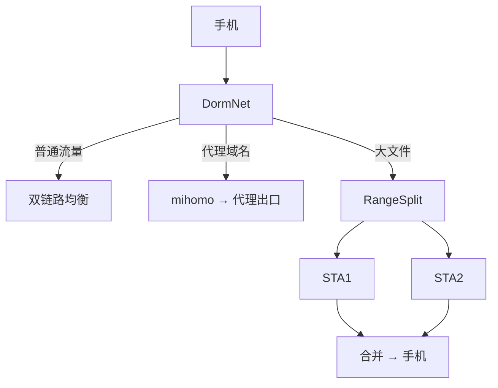

宿舍里只有一个校园网有线口。但我有两个校园网账号，还有手机、平板、电脑一堆设备。校园网对单账号又有限速，实测一条链路大概只有 **17.5 MB/s**。自然会想到：两个账号同时用，不就能多一条带宽了吗？

问题是，普通的多 WAN 负载均衡解决不了我真正想要的东西。我希望手机连上一个 Wi-Fi 之后，所有流量都从这台机器出去；普通流量可以同时利用两条校园网链路，而需要特殊网络出口的域名单独走代理；如果碰到一个很大的文件，最好连一个下载连接也能把两条链路吃起来。

最后，我把一台带无线网卡的迷你主机改成了宿舍里的网络中枢。给它起了个名字：**DormNet**。

---

## 1. 先把网络接起来

现在 DormNet 的硬件连接其实很简单。一块无线网卡作为 AP，给宿舍里的设备发 Wi-Fi；另外两块无线网卡分别连两个校园网上游账号。大概是这样：



AP 这一侧使用 `192.168.50.0/24`。对客户端来说，它就是一个普通的 Wi-Fi：`DormNet`。客户端并不知道后面还有两条校园网链路，更不需要分别登录两个账号。

---

## 2. 为什么普通的多 WAN 不够

如果只是让不同连接轮流走两条链路，其实并不难：

```text
TCP 连接 A → STA1
TCP 连接 B → STA2
TCP 连接 C → STA1
TCP 连接 D → STA2
```

多设备同时使用的时候，这已经能把两条链路都利用起来。但我想解决的是一个更麻烦的情况：**单个大文件下载。**

假设一个文件只有一个 TCP 连接，那么这个连接一旦选中了 STA1，后面的数据基本就都在 STA1 上跑了，另一条链路只能看着。

所以我最后做了一个比较笨、但确实有效的办法：**MITM + RangeSplit。**



MITM 在响应头阶段判断当前请求是否适合做 Range 分段。如果符合条件，就把原始 URL 交给 RangeSplit。RangeSplit 再把文件拆成两个 Range，分别从两条校园网链路下载，最后合起来返回给客户端。

实际测下来，单连接下载最高跑到了 **19.7 MB/s**。这里得说明一下：单链路测速大约 17.5 MB/s，两条链路简单相加的理论上限应该接近 35 MB/s，19.7 MB/s 说明这个方案确实吃到了两条链路的一部分带宽，离理想值还有差距。不过对我来说已经够证明方案成立，而且 CPU 只有 **5～7%**。

所以我后来认真考虑过要不要把 RangeSplit 用 C 重写，最后没写。当时瓶颈已经明显不在 CPU 上，继续优化实现语言意义不大。更何况 MITM 本身已经把 TTFB 从直连的约 **0.09 s** 拉到了约 **0.6 s**——对小文件、网页加载的体感影响很明显。这时候再花大量时间换 C，收益实在有限。（后来我用"学习型透传"把已确认的小流量域名直接放行、不再 MITM，这部分 TTFB 才回到接近直连的水平。）

---

## 3. 第一个 502：问题居然出在证书

RangeSplit 跑起来以后，并没有马上进入稳定运行状态。有些网站直接 502。

最开始我当然怀疑 MITM 或者 RangeSplit 的逻辑。后来抓到一个比较特殊的请求：

```text
https://183.60.240.63/...
```

这里客户端实际上是直接拿 IP 访问 HTTPS。MITM 里的 `req.url` 拿到自然也是 IP。RangeSplit 后面又拿这个地址去 `curl -I` 探测，然后就炸了。

原因很普通：**HTTPS 证书一般签给域名，不签给这个裸 IP。** 流程变成：

```text
IP URL → RangeSplit → curl HTTPS → 证书 SAN 不匹配 → 502
```

真正的问题其实发生在 TLS 校验，但最后表现给我的只有一个 `502 Bad Gateway`。

最后我调整了 `X-Original-URL` 的生成方式，用 `f"{req.scheme}://{req.pretty_host}{req.path}"` 保留请求中的主机名信息。对于内部探测这种场景，也处理了证书校验问题。这个问题解决以后，才算真正开始进入下一阶段。

---

## 4. 然后我想让它顺便做代理

网络聚合解决的是速度。但我平时还会遇到另一类需求：有些域名需要代理，有些完全不需要。所以 DormNet 又加了一层按域名分流。

最开始的方案很简单：dnsmasq 解析到指定域名的时候，把对应地址加入 `ipset`（`github.com`、`steampowered.com` 这类进 `proxy_set`，其他域名走普通双链路），然后 iptables 根据这个集合判断目标 IP 是否命中：

```text
目标 IP ∈ proxy_set → mihomo
目标 IP ∉ proxy_set → 双链路
```

从结构上看没什么问题。真正的问题，是我后来才发现 Linux 网络栈并不会按照我脑子里的顺序工作。

---

## 5. 第一个透明代理坑：包明明 REDIRECT 了，mihomo 却没有收到

当时的现象非常奇怪。iptables 的规则计数在涨，说明规则确实匹配到了，但 mihomo 没有任何流量。我又去抓包，还是没有。

最后才发现，问题出在前面的策略路由。DormNet 为了让两条校园网链路工作，需要在 mangle PREROUTING 给客户端连接打 mark（`MARK 0x1` / `MARK 0x2`），而代理流量又被 REDIRECT。实际发生的是：



也就是说，包虽然被标记成"我要代理"，但路由系统仍然把它当成普通的双链路流量处理了，跟我预想的不一样。

最后的解决办法也很简单：**代理流量不要参加前面的 mark。** 在普通链路 mark 规则之前，先把代理目标 `RETURN` 掉。

这个坑之后，我开始养成一个习惯：看见"iptables 匹配了，但服务没收到"，先别怀疑服务。

---

## 6. 第二个坑：包根本没到 127.0.0.1

mark 处理完之后，还是不行。这一次 tcpdump 依然看不到 mihomo 的流量。继续往内核里查，最后发现是 `net.ipv4.conf.all.route_localnet` 默认是关闭的。

而透明代理这边需要把外部接口进来的流量送到本机的 loopback：`外部接口 → 127.0.0.1:7892`。这当然会触发内核对 loopback 地址的检查，包在真正到达 mihomo 之前就没了。没有日志，没有明显错误，就是没了。

最后开启 `net.ipv4.conf.all.route_localnet=1`，并写进 `/etc/sysctl.d/` 持久化。

这类问题特别适合用抓包排。因为如果你只看应用层，最后很容易得到一个结论："mihomo 怎么坏了？"实际上 mihomo 连包都没见过。

---

## 7. 第三个坑：REDIRECT 到底把包送到了哪里？

解决完 `route_localnet`，我以为终于好了。结果手机还是连不上。这一次服务器自己测试却是正常的。

我对比"服务器自己发起"和"手机 → AP → DormNet"两条路径，最后抓到一个很容易被忽略的细节：**PREROUTING 里的 REDIRECT，并不一定把目标地址变成 `127.0.0.1`。**

外部接口进来的流量，目标可能变成 AP 本机地址 `192.168.50.1:7892`，但 mihomo 当时监听的是 `127.0.0.1:7892`。内核收到 `192.168.50.1:7892`，发现没人监听，然后回 RST，手机看到的自然就是连不上。

最后我不用这种不够明确的 REDIRECT 方式，改成显式 DNAT：`DNAT → 127.0.0.1:7892`，问题解决。到这里，透明代理这条链路才算真正打通

---

## 8. Safari 能上，Edge 却超时

这时候又出现了一个特别有意思的问题。Safari 正常，Edge / Firefox 某些网站却 `ERR_TIMED_OUT`。

我第一反应还是规则有问题。后来才发现，之前那套 `DNS → ipset → iptables` 本身就有一个前提：**客户端必须使用我的 DNS。** 但现代浏览器可能自己启用 DoH，于是浏览器的路径变成 `浏览器 → DoH → 外部 DNS → IP`，dnsmasq 根本没有参与，自然也就不会把对应 IP 放进 `proxy_set`。

还有另一个问题：校园网 DNS 本身并不是完全可信的来源。

这让我意识到：如果代理分流是否成立，完全取决于 DNS 有没有按我的预期工作，那这个设计本身就比较脆弱。于是我把思路换了，不再单纯依赖 DNS 结果判断域名。

---

## 9. 从 DNS 分流改成连接嗅探

后来的方案是让 HTTPS 流量先进入 mihomo，再由它根据连接中的域名信息做规则判断：



这样浏览器究竟使用哪个 DNS，就不再是唯一的分流依据。mihomo 可以通过自己的解析路径获取目标地址，再根据域名规则处理。这也解决了之前"Safari 正常、Edge 不正常"的一部分问题。

---

## 10. 然后又碰到了 ECH

不过，事情没有这么简单。有些 CDN 还是不行。这次的问题出在 ECH，跟 DoH 无关。

以前可以从 TLS ClientHello 里看到 SNI，所以 mihomo 能知道"这个连接其实是 xxx.com"。但 ECH 会把这部分信息加密起来，于是某些连接最后只剩 IP、没有域名，那我的域名规则自然也就匹配不上。

最后只能对一些已知 CDN 增加 IP-CIDR 规则。这其实不是一个特别优雅的方案，但网络环境就是这样：你能拿到什么信息，就只能用什么信息做判断。

也正是做到这里，我才发现，所谓"按域名分流"并没有想象中那么简单。DNS、DoH、SNI、ECH，每一层都可能改变你能够观察到的信息。

---

## 11. 有一次，我差点把所有流量都送进代理

还有一个配置上的小事故。当时为了测试，我把 `MATCH` 指向了代理节点。然后整个 DormNet 的流量都开始走代理：国内网站、普通下载、甚至根本不需要代理的请求，全进去了。

这显然不是我想要的。所以最后规则变成：明确需要代理的走 `PROXY`，其他一律 `DIRECT`，也就是 `MATCH → DIRECT`。

**按需代理最重要的其实是默认直连，代理规则反而排在后面。** 这个规则定下来以后，整个系统就清楚多了。

---

## 12. 能用了，但我还想有个面板

到这里，DormNet 已经能正常工作。但每次改一个域名都要 SSH 上去改配置，实在有点不像一个长期运行的东西。所以我又给它写了个 WebUI：**dormnet.web**。

前端是 MUI + Next.js。现在首页主要能看到：

* 两条链路状态；
* EAP 连接情况；
* 信道和信号；
* 实时上下行带宽；
* 当前 AP 客户端（IP / MAC / 信号 / 速率）；
* 在线设备踢出；
* 代理域名管理。

代理域名这块，我做成了比较简单的输入框 + Chip：输入 `github.com`，后台负责同步对应的系统配置。

另外还做了一点比较实验性的东西：根据流量特征观察哪些域名更容易产生大文件请求，从而辅助判断哪些流量值得进入 RangeSplit。

---

## 13. WebUI 也不能直接拿 root

不过写到这里又遇到了权限问题。修改网络配置显然需要 root，但总不能让 Next.js 整个进程直接 root 跑。

所以我现在的处理方式是：`浏览器 → Next.js API → sudo -n → 受控脚本 → Python → 系统配置`。WebUI 只负责发起一个明确的操作，真正需要权限的部分交给受控脚本处理，配置内容通过管道传递，而不是让 Web 服务直接拥有一个万能 root shell。

这一块目前也不算什么特别复杂的安全架构。

---

## 14. 最后一个问题：重启

手动启动的时候，一切都好好的。然后我 `reboot`……没了。

这其实是整个项目里最典型的一类问题：**单独看每个服务都没问题，但启动顺序错了。** DormNet 有 dnsmasq、ipset、iptables、mihomo、MITM、RangeSplit、WebUI、AP 这么多东西，它们之间有依赖顺序，例如 iptables 规则引用了 ipset，那 ipset 就得先存在。

所以实际启动关系大概应该是：


最后用 systemd 的依赖关系把这些东西串起来。另外把 `net.ipv4.conf.all.route_localnet=1` 放进 `/etc/sysctl.d/`，iptables 用 `netfilter-persistent` 保存。

目前主要持久化的服务有：`rangesplit-proxy`、`mitm-aggr`、`dormnet-web-https`、`dormnet-ui`、`dnsmasq`、`gost-aggr`、`mihomo`、`tailscaled`、`dormnet-proxy-setup`。开机以后由 `dormnet-proxy-setup` 负责重建需要的 ipset 和规则

---

## 15. 排障最后还是回到了最原始的办法

整个项目折腾下来，我最后最常用的反而就是那几个最基础的工具：`iptables`、`conntrack`、`tcpdump`、`journalctl`。基本按照这个顺序：

```text
iptables 计数有没有增长？
        ↓
conntrack 里有没有连接？
        ↓
tcpdump 里包到哪了？
        ↓
路由决定往哪走？
        ↓
服务有没有收到？
        ↓
应用层到底返回了什么？
```

还有一次 mihomo 的日志文件看起来完全没更新，我差点以为服务没工作。结果 `journalctl -u mihomo` 一看，日志全在。

所以现在遇到网络问题，我会尽量少猜。**先找到包。** 只要知道包现在在哪里，剩下的问题通常就只是：它为什么会在那里？

---

## 16. 现在的 DormNet

现在手机连上 `DormNet`，后面实际上会发生很多事情：



但这些对使用者来说都不可见。它就是一个 Wi-Fi。

我觉得这也是这个项目目前最有意思的地方。一开始只是觉得可以聚合一下舍友的网速，后来却慢慢把 DNS、策略路由、透明代理、流量识别、Range 请求和 WebUI 全塞进了这台小主机里。现在它就安静地放在宿舍角落，平时没什么存在感。只有某个网页突然打不开的时候，我才会打开终端敲 `iptables`、`tcpdump`、`journalctl`，然后开始找：**这个包到底跑哪去了？（怒）**
